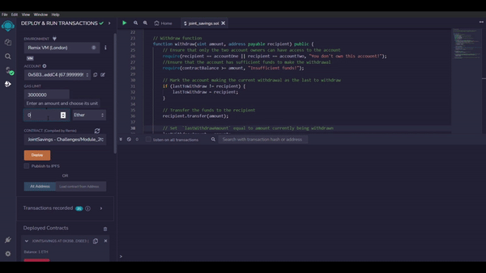

# Joint Savings Account
This is a smart contract written in Solidity that manages a joint savings account between two Ethereum addresses. The contract can perform the following functions:

* Deposit ether into the account balance of the contract
* Assign two ethereum addresses that will be able to make withdrawals
* Make a withdrawal from the contract account to one of the designated addresses
* Check the balance of the contract account
* Check the last address to make a withdrawal
* Check the amount of the last withdrawal

To make a withdrawal from the contract, the recipient of the withdrawal must be one of the addresses assigned to the contract. This is coded into the `withdraw` function.

```
function withdraw(uint amount, address payable recipient) public {
        // Ensure that only the two account owners can have access to the account
        require(recipient == accountOne || recipient == accountTwo, "You don't own this accouont!");
        //Ensure that the account has sufficient funds to make the withdrawal
        require(contractBalance >= amount, "Insufficient funds!");

        // Mark the account making the current withdrawal as the last to withdraw
        if (lastToWithdraw != recipient) {
            lastToWithdraw = recipient;
        }

        // Transfer the funds to the recipient
        recipient.transfer(amount);

        // Set  `lastWithdrawAmount` equal to amount currently being withdrawn
        lastWithdrawAmount = amount;

        // Update the contract balance to the new balance after the withdrawal
        contractBalance = address(this).balance;
    }
```

To test the functionality of the contract I used the Remix VM. This VM allows smart contract developers to interact with their contracts without connecting to the live blockchain. Below you can see the process of using the contract to make transactions and check that they have been successful.



Screenshots showing the execution of all of the functions can be found in the `execution_results` folder.